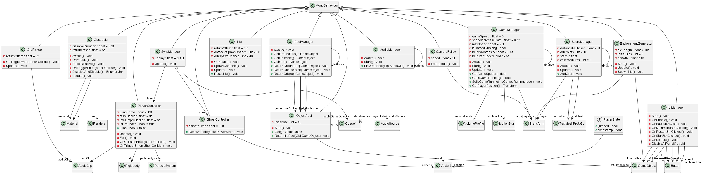

**Sync Dash** is a hyper-casual mobile game prototype built in Unity. It showcases a clever implementation of real-time state synchronization by simulating multiplayer locally — no servers required. The screen is divided into two halves:

- **Right Side** → Player controls a glowing cube that auto-runs and jumps over obstacles.
- **Left Side** → A ghost cube mirrors the player’s actions in real-time with optional delay and interpolation, mimicking network syncing behavior.

---

##  Game Features

###  Core Mechanics
Player cube auto-moves on right side of screen

Left side mirrors player actions as ghost (via queue-based state sync)
Tap to jump over obstacles
Collect glowing orbs to earn points
Game speed increases over time
Ghost sync includes optional latency + interpolation
Object pooling used for ground, obstacles, and orbs
Shader effects:
Player glow shader
Obstacle dissolve shader
Orb collection particle burst
Motion blur increases during speed boosts
Dual camera split-screen setup (player + ghost views)

### Plant UML 
 